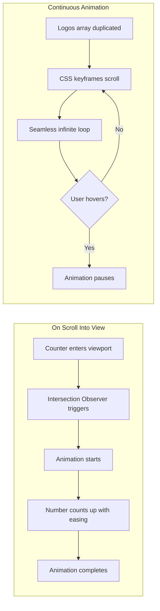

# TechPotato Website Complete Revamp Plan

## Overview

Revamp the TechPotato website with:

- Centralized JSON content management for all website data
- Animated logo carousels for tech partners and client brands
- Enhanced scroll-triggered number animations
- Mobile-optimized responsive components
- Updated content for 6-month-old AI-focused startup

---

## Architecture: Content Management System

### Centralized Content JSON Structure

Create a single source of truth for all website content:

```javascript
src/
├── content/
│   └── siteContent.json      # All website content
├── components/
│   ├── Hero.tsx              # Reads from siteContent.json
│   ├── Services.tsx          # Reads from siteContent.json
│   ├── Partners.tsx          # NEW - Tech partner carousel
│   ├── Clients.tsx           # NEW - Client logo carousel
│   └── ...
└── hooks/
    └── useContent.ts         # Custom hook to access content
```


### JSON Content Structure

```json
{
  "company": { "name", "tagline", "description", "founded", "location" },
  "hero": { "badge", "headline", "subtitle", "cta", "stats" },
  "about": { "story", "mission", "team", "values", "highlights" },
  "services": [ { "title", "description", "features", "icon" } ],
  "portfolio": [ { "title", "category", "description", "tech", "results" } ],
  "testimonials": [ { "name", "role", "company", "quote", "image" } ],
  "blog": [ { "title", "excerpt", "date", "category", "author" } ],
  "partners": [ { "name", "logo", "url" } ],
  "clients": [ { "name", "logo", "industry" } ],
  "contact": { "email", "phone", "whatsapp", "address", "hours" },
  "social": { "linkedin", "twitter", "github", "instagram" },
  "faq": [ { "question", "answer" } ],
  "careers": { "openings", "perks", "email" }
}
```

---

## Phase 1: Content Infrastructure

### 1.1 Create Content JSON File

Create [`src/content/siteContent.json`](src/content/siteContent.json) with all website content including:

- Company information and branding
- Hero section content with AI-focused messaging
- Updated services (Web Apps, Mobile, AI Integration, MVP, UI/UX)
- Portfolio projects with detailed case info
- Team member data
- Tech partner logos (React, Node.js, AWS, MongoDB, OpenAI, TypeScript, etc.)
- Client logos (anonymized or real brands)
- Contact information
- FAQ data
- Career/hiring information

### 1.2 Create Content Hook

Create [`src/hooks/useContent.ts`](src/hooks/useContent.ts):

```typescript
import siteContent from '../content/siteContent.json';

export const useContent = () => siteContent;
export const useHero = () => siteContent.hero;
export const useServices = () => siteContent.services;
// ... etc
```


### 1.3 Create Type Definitions

Create [`src/types/content.ts`](src/types/content.ts) with TypeScript interfaces for all content structures to ensure type safety.---

## Phase 2: New Animated Components

### 2.1 Tech Partners Carousel (NEW)

Create [`src/components/Partners.tsx`](src/components/Partners.tsx):Features:

- Infinite auto-scrolling marquee effect (CSS animation)
- Technology partner logos (React, Node, AWS, OpenAI, MongoDB, etc.)
- Hover pause functionality
- Grayscale to color on hover effect
- Mobile responsive (slower speed on mobile)
- Uses Framer Motion for smooth animations

Implementation approach:

- Duplicate logo array for seamless infinite scroll
- CSS `@keyframes` for continuous marquee animation
- `animation-play-state: paused` on hover

### 2.2 Client Brands Carousel (NEW)

Create [`src/components/Clients.tsx`](src/components/Clients.tsx):Features:

- Similar marquee effect, opposite scroll direction
- Client/brand logos with industry labels
- "Trusted By" or "Our Clients" heading
- Grayscale default, color on hover
- Mobile optimized

### 2.3 Animated Counter Component (Enhanced)

Create [`src/components/AnimatedCounter.tsx`](src/components/AnimatedCounter.tsx):Features:

- Intersection Observer to trigger on scroll into view
- Configurable duration, start value, end value
- Easing function for smooth animation
- Suffix support (+, %, h, etc.)
- Only animates once when scrolled into view
- Reusable across Hero, About, Testimonials sections
```typescript
interface AnimatedCounterProps {
  end: number;
  duration?: number;
  suffix?: string;
  prefix?: string;
}
```


---

## Phase 3: Component Updates (Using JSON Content)

### 3.1 Hero Section ([`src/components/Hero.tsx`](src/components/Hero.tsx))

Updates:

- Import content from JSON instead of hardcoded
- Use new AnimatedCounter component for stats
- Update content to AI-focused messaging
- Stats animate when scrolled into view

### 3.2 Services Section ([`src/components/Services.tsx`](src/components/Services.tsx))

Updates:

- Read services array from JSON
- Add AI Integration service
- Add MVP Development service
- Remove Cybersecurity and Digital Transformation
- Dynamic icon mapping from JSON icon names

### 3.3 About Section ([`src/components/About.tsx`](src/components/About.tsx))

Updates:

- Read from JSON content
- Add team member cards from JSON
- Use AnimatedCounter for stats
- Update story content

### 3.4 Portfolio Section ([`src/components/Portfolio.tsx`](src/components/Portfolio.tsx))

Updates:

- Read projects from JSON
- Reduce to 2-3 real projects
- Add detailed project info (duration, results, tech stack)

### 3.5 Testimonials Section ([`src/components/Testimonials.tsx`](src/components/Testimonials.tsx))

Updates:

- Read from JSON
- Use AnimatedCounter for stats
- Option to show "Why Us" if no testimonials in JSON

### 3.6 Blog Section ([`src/components/Blog.tsx`](src/components/Blog.tsx))

Updates:

- Read posts from JSON
- Updated dates (2025-2026)
- AI/startup focused topics

### 3.7 Contact Section ([`src/components/Contact.tsx`](src/components/Contact.tsx))

Updates:

- Read contact info from JSON
- Read FAQ from JSON
- Add WhatsApp link
- Add hiring banner from JSON careers data

### 3.8 Footer Section ([`src/components/Footer.tsx`](src/components/Footer.tsx))

Updates:

- Read all info from JSON
- Sync services, contact, social links

---

## Phase 4: App Integration

### 4.1 Update App.tsx ([`src/App.tsx`](src/App.tsx))

Add new components to layout:

```tsx
<Header />
<Hero />
<Partners />      {/* NEW - Tech partners carousel */}
<About />
<Services />
<Clients />       {/* NEW - Client brands carousel */}
<Portfolio />
<Testimonials />
<Blog />
<Contact />
<Footer />
```


### 4.2 Add Logo Assets

Create [`public/logos/`](public/logos/) directory with:

- Tech partner SVGs (react.svg, nodejs.svg, aws.svg, openai.svg, etc.)
- Client logo images (can be placeholders initially)

---

## File Structure Summary

```javascript
src/
├── content/
│   └── siteContent.json          # NEW - Central content file
├── types/
│   └── content.ts                # NEW - TypeScript types
├── hooks/
│   └── useContent.ts             # NEW - Content access hook
├── components/
│   ├── Partners.tsx              # NEW - Tech carousel
│   ├── Clients.tsx               # NEW - Client carousel
│   ├── AnimatedCounter.tsx       # NEW - Scroll counter
│   ├── Hero.tsx                  # UPDATE
│   ├── Services.tsx              # UPDATE
│   ├── About.tsx                 # UPDATE
│   ├── Portfolio.tsx             # UPDATE
│   ├── Testimonials.tsx          # UPDATE
│   ├── Blog.tsx                  # UPDATE
│   ├── Contact.tsx               # UPDATE
│   └── Footer.tsx                # UPDATE
└── App.tsx                       # UPDATE
public/
└── logos/                        # NEW - Logo assets
    ├── react.svg
    ├── nodejs.svg
    └── ...
```

---

## Mobile Optimization Notes

All new components will be mobile-first with:

- Responsive carousel speeds (slower on mobile)
- Touch-friendly interactions
- Proper spacing and sizing via Tailwind responsive classes
- Carousel auto-pause on touch devices
- Readable text sizes on small screens

---

## Animation Flow



---

## Implementation Order

1. Create content infrastructure (JSON, types, hooks)
2. Create AnimatedCounter component
3. Create Partners carousel component
4. Create Clients carousel component
5. Update Hero with JSON + AnimatedCounter
6. Update remaining components to use JSON
7. Add logo assets
8. Update App.tsx with new component order